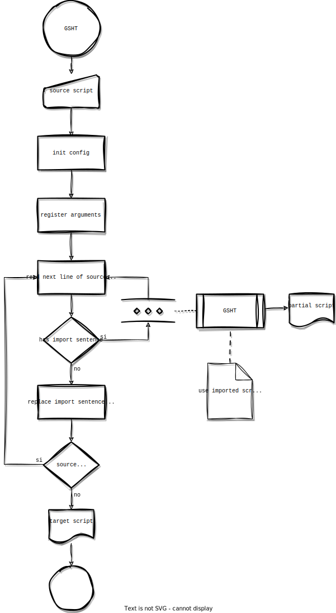

# Global Shell Transpiler

[](https://www.gnu.org/software/bash/)
[](https://gitHub.com/NekoOs/gsht.sh/releases/latest)
[](https://github.com/NekoOs/gsht.sh/actions/workflows/tags.yml)
[](https://github.com/NekoOs/gsht.sh/actions/workflows/draft.yml)
[](https://github.com/NekoOs/gsht.sh/issues)
[](https://github.com/NekoOs/gsht.sh/releases)

Translations: [English](README.md) - [Español](README.es_ES.md)

## About

`gsht` is a shell script transpiler that allows you to divide source code in a modular way within a project,
to later mix the different files implemented in a single file.

### Lifecycle Diagram

To better understand the workflow and the different stages involved in the process,
we've provided a lifecycle diagram below.
This diagram outlines the key steps from start to finish, highlighting how the components interact and how data
flows through the system.



## Installation and update

### Installation and update script

To **install** or **update** `gsht`, you can download and run the script manually, or I used the following cURL or Wget
command:

```bash
curl -L https://github.com/NekoOs/gsht.sh/releases/download/v0.1.0/gsht > gsht
```

```bash
wget https://github.com/NekoOs/gsht.sh/releases/download/v0.1.0/gsht
```

> To use `gsht` globally place the generated file in the binaries directory
> ```bash
> sudo mv gsht /usr/local/bin/
> sudo chmod a+x /usr/local/bin/gsht
> ```

## Use

Imagine a structure like this:

```text
/our-project-path
 ├── foo
 │ └── bar
 │ │ └── file-4.sh
 │ └── file-3.sh
 ├── file-1.sh
 └── file-2.sh
```

Contents of the file `/our-project-path/file-1.sh`

```
#!/usr/bin/env bash

echo "file 1 here!"

source ./foo/file-3.sh
```

Contents of the file `/our-project-path/file-2.sh`

```
#!/usr/bin/env bash

echo "file 2 here!"
```

Contents of the file `/our-project-path/foo/file-3.sh`

```
#!/usr/bin/env bash

echo "file 3 here!"

source ./bar/file-4.sh
```

Contents of the file `/our-project-path/foo/bar/file-4.sh`

```
#!/usr/bin/env bash

echo "file 4 here!"

source ../../file-2.sh
```

Run the following:

```bash
gsht /our-project-path/file-1.sh --output file-transpiled
```

> Only the input filename is required `gsht source [--output=target]`.
> If the name of the output file has not been specified, the script will default to a name based on the
> input file, for example, above something like this: `/our-current-path/file-1`

The generated content will be:

```bash
#!/usr/bin/env bash

echo "file 1 here!"

echo "file 3 here!"

echo "file 4 here!"

echo "file 2 here!"
```

### Watching Assets For Changes

`gsht` offers the `watch` option which will continue to run in your terminal and watch all files re-transpiling
automatically:

```bash
gsht --watch --input source --output target
```

## Running Tests

To run the tests, execute:

```bash
tests/run
```

This script will automatically run all tests in the `tests/` directory using Bats.

[1]: https://github.com/NekoOs/gsht.sh
